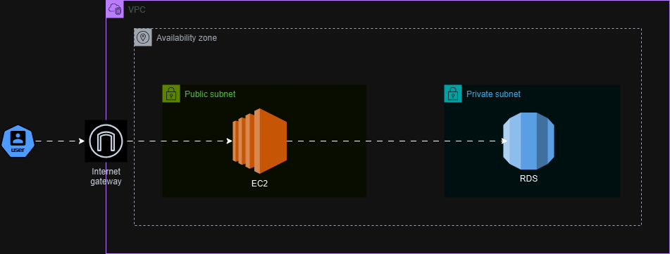

# AWS VPC Architecture with Terraform

## Description
This Terraform project creates a secure and scalable AWS Virtual Private Cloud (VPC) architecture.
It includes public and private subnets, an EC2 instance, an RDS database, and proper route table configurations.
The Terraform state is stored in an S3 bucket with DynamoDB for state locking.

## Architectural Diagram



## Architecture Overview
This architecture consists of the following components:
1. **VPC**: A customer Virtual Private Cloud with a defined CIDR block.
2. **Public Subnet**: Hosts an EC2 instance and allows internet access through an Internet Gateway.
3. **Private Subnet**: Hosts an Amazon RDS database, isolated from public internet access.
4. **Route Tables**:
   - Public route table for internet traffic, associated with the public subnet.
   - Private route table for internal communication within the private subnet.
5. **EC2 Instance**: A web server hosted in the public subnet.
6. **RDS Database**: A MySQL database hosted in the private subnet.
7. **Backend Configuration**: The Terraform state is stored in an S3 bucket with DynamoDB for state locking to ensure collaborative workflows.

## Pre-requisites
1. **Terraform Installed**: Install Terraform from the [*official website*](https://developer.hashicorp.com/terraform/install).
2. **AWS CLI Installed**: Install the [*AWS CLI*](https://docs.aws.amazon.com/cli/latest/userguide/getting-started-install.html) and configure your credentials using ```aws configure```.
3. **IAM User/Role Permissions**:
   - Access to create VPC, subnets, EC2, RDS, S3, DynamoDB, and route tables.
   - Permissions for the S3 bucket and DynamoDB table (for state storage and locking).
